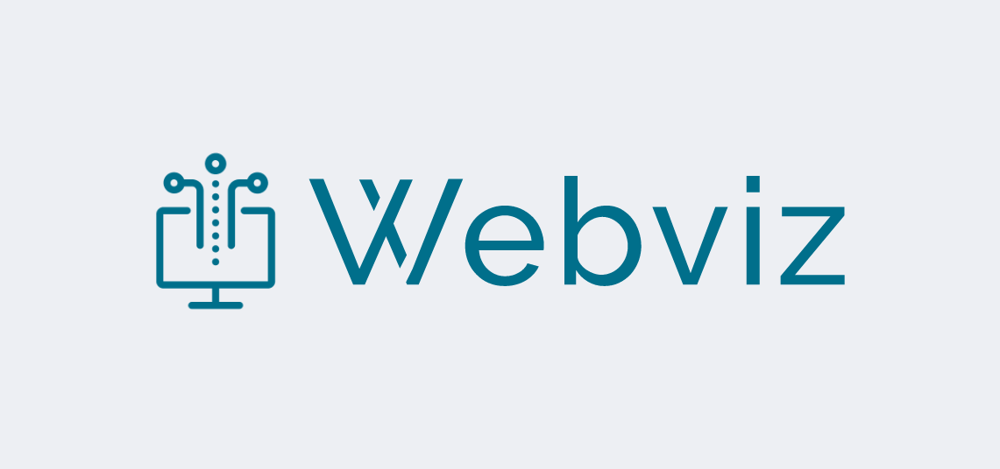

<br/>
<p align="center" style="background:#edeff3;">
        
</p>

<br/>
<p align="center">
    <a href="https://github.com/NESTLab/argos3-webviz/blob/master/LICENSE" target="_blank">
        
    </a>
    <a href="https://github.com/NESTLab/argos3-webviz/releases" target="_blank">
        
    </a>
    <a href="https://github.com/NESTLab/argos3-webviz/commits/master" target="_blank">
        
    </a>
        

</p>
<br/>


# ARGoS3-Webviz
A Web interface plugin for [ARGoS 3](https://www.argos-sim.info/).

| All builds | Ubuntu 16.04  | Ubuntu 18.04  | Mac OSX |
|:-:|:-:|:-:|:-:|
| [](https://travis-ci.com/NESTLab/argos3-webviz) | [](https://travis-ci.com/NESTLab/argos3-webviz) | [](https://travis-ci.com/NESTLab/argos3-webviz) | [](https://travis-ci.com/NESTLab/argos3-webviz) |

## Features


- All communication over Websockets
- SSL support (protocol `wss://`)
- Only single port needed(Easier for NAT/forwarding/docker)
- filterable channels (broadcasts, events, logs)
- easily extendable for custom robots/entities.
- Independent Web client files.
- Simple client protocol, can easily be implemented in any technology
- Using UWebSockets, which is blazing fast([Benchmarks](https://github.com/uNetworking/uWebSockets/blob/master/misc/websocket_lineup.png)).
- The event-loop is native epoll on Linux, native kqueue on macOS
## Installing

### Dependencies
#### Homebrew 
```console
$ brew install cmake git zlib openssl
```
#### Debian
```console
$ sudo apt install cmake git zlib1g-dev libssl-dev
```
#### Fedora
```console
$ sudo dnf install cmake git zlib-devel openssl-devel
```

You can [Download pre-compiled binaries from Releases](https://github.com/NESTLab/argos3-webviz/releases)

or

<details>
<summary style="font-size:18px">Installing from source</summary>
<br>

### Requirements
- A `UNIX` system (Linux or Mac OSX; Microsoft Windows is not supported)
- `ARGoS 3`
- `g++` >= 7 (on Linux)
- `clang` >= 3.1 (on MacOSX)
- `cmake` >= 3.5.1
- `zlib` >= 1.x
- `git` (for autoinstalling dependencies using Cmake `ExternalProject`)

**Optional dependency**
- `OpenSSL` >= 1.1 (for websockets over SSL)

Please [install all dependencies](#installing) before continuing


### Downloading the source-code
```console
$ git clone https://github.com/NESTLab/argos3-webviz
```

### Compiling
The compilation is configured through CMake.

```console
$ cd argos3-webviz
$ mkdir build
$ cd build
$ cmake -DCMAKE_BUILD_TYPE=Release ../src
$ make
$ sudo make install
```

You can use `-DCMAKE_BUILD_TYPE=Debug` instead of `Release` with the cmake command above to enable debugging.

</details>


## Contributing
Pull requests are welcome. For major changes, please open an issue first to discuss what you would like to change.

Please make sure to update tests as appropriate.
[Check full contributing info](docs/CONTRIBUTING.md)

## License
[MIT](https://choosealicense.com/licenses/mit/)

Licenses of libraries used are in their respective directories.


## Limitations
OpenGL Loop functions are currently neglected in this plugin, as they are QT-OpenGL specific.